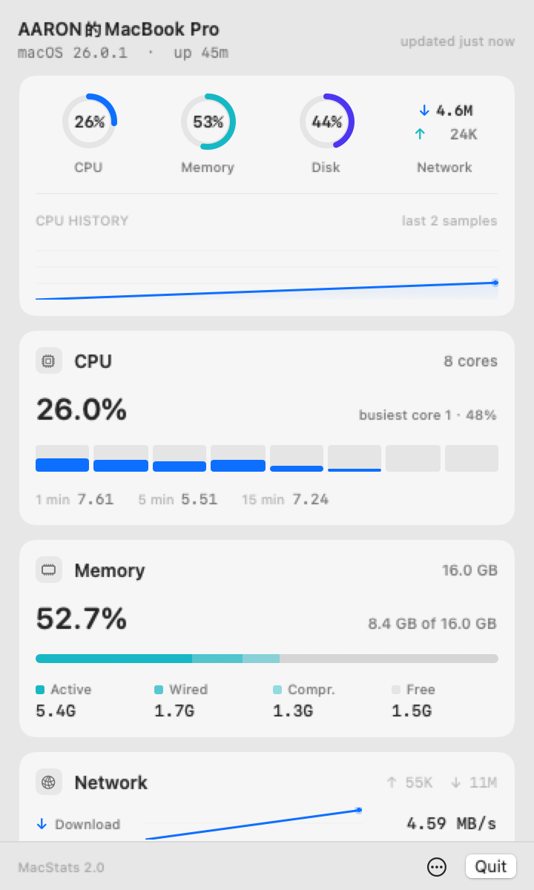
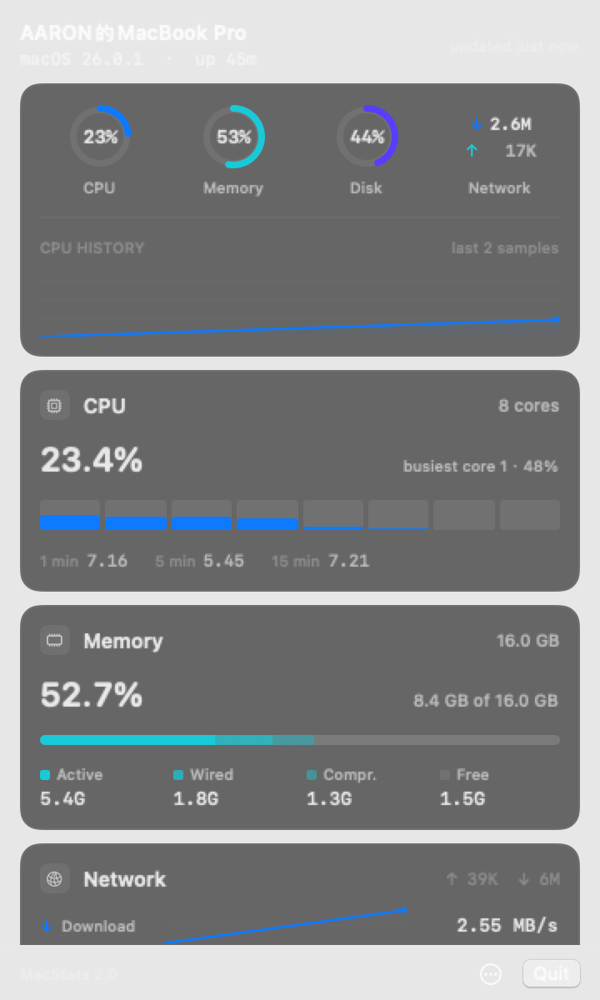

# MacStats

A lightweight, native macOS menu bar system monitor. Real-time CPU, memory,
network, disk, battery and Wi-Fi stats — zero dependencies, pure Swift.


<p align="center">
  
  
</p>

## What's new in 2.1

- **GPU panel** — utilization, GPU name and memory in use, read from
  `IOAccelerator` driver statistics.
- **Thermals** — CPU temperature and fan RPM straight from the AppleSMC.
- **TCP connections** — established / listening / time-wait counts plus
  listening ports, enumerated in-process with libproc (no `netstat` subprocess).
- **Real disk throughput** — read/write rates and session totals from
  `IOBlockStorageDriver` byte counters.
- **Process manager** — top 5/10/20, sort by CPU or memory, filter by name or
  executable path, and quit or force-quit from a row's context menu.
- **Threshold alerts** — an in-popover banner plus native notifications for CPU,
  memory, disk, battery, thermal and temperature breaches, rate-limited per
  condition.
- **CSV export** — write the bounded session buffer (~2 h) to a
  spreadsheet-ready file from either menu.

## What's new in 2.0

- **Restyled around a single instrument surface.** Four gauges (CPU, memory,
  disk, network) over one wide CPU trace; flat hairline panels instead of
  shadowed cards; monochrome chrome where color only ever means state.
- **Menu bar display styles** — full (CPU/memory/network), compact, CPU only,
  or chart only. Right-click → *Menu Bar* to switch.
- **Refresh rate control** — 2s / 3s / 5s / 10s, with automatic slowdown in
  Low Power Mode and under thermal pressure.
- **Sampling pauses entirely** while the display sleeps or the screen is locked.
- **Sharper, cheaper status bar chart** drawn at the display's backing scale
  from a reused bitmap context.
- **Top-process list** with CPU/memory sorting and hover highlighting.
- **More detail where it helps**: CPU load averages, memory pressure, disk
  volume name, Wi-Fi link rate and band, session ↑/↓ totals.
- **Roughly 13× cheaper sampling passes** (0.60 ms → 0.044 ms) and ~35% less
  idle CPU — see [docs/performance.md](docs/performance.md).

## Features

**Menu Bar** — always-visible metrics at a glance:

- CPU %, memory %, upload/download speeds (per display style)
- Live CPU history chart with threshold coloring

**Popover Dashboard** (left-click the menu bar item):

- Overview cluster: CPU / memory / disk gauges + network speeds + CPU trace
- Per-core CPU equalizer with load averages and busiest core
- GPU utilization, name and memory in use
- Memory composition (active, wired, compressed, free) with pressure state
- Network channels with shared-scale traces, session totals and TCP state chips
- Wi-Fi signal, SSID, IP, channel/band and link rate
- Disk capacity for the boot volume, plus live read/write throughput
- Thermals from the AppleSMC (CPU temperature, fan RPM) when available
- Battery charge, time estimate, health, cycles and temperature
- Process browser: top 5/10/20, sortable by CPU or memory, filterable, with
  quit / force-quit actions
- Alert banner for active threshold breaches

**Right-click Menu / Popover "…" Menu**:

- Open Activity Monitor · Copy stats summary · Export Metrics CSV
- Quick Actions: Sleep Display, Toggle Dark Mode, Restart Finder
- Alerts: enable/disable threshold alerts, send a test notification
- Menu bar style · Refresh rate · Launch at Login

MacStats runs as a menu-bar-only agent (`.accessory`): no Dock icon, no main
window. That is deliberate product behavior, not a launch bug.

## Install

### Build and run from source

Requires **Xcode Command Line Tools** and **macOS 13+** (Ventura or later).

```bash
git clone https://github.com/macstats/MacStats.git
cd MacStats

# kill → build → launch as a real .app bundle (dist/MacStats.app)
./script/build_and_run.sh

# optional modes
./script/build_and_run.sh --verify   # launch and confirm the process is alive
./script/build_and_run.sh --logs     # stream unified logs
./script/build_and_run.sh --debug    # run under lldb
```

### Build a distributable bundle

```bash
# universal binary (arm64 + x86_64), ad-hoc signed
bash Scripts/bundle.sh
open .build/release/MacStats.app

# optional DMG
bash Scripts/dmg.sh
```

To keep it running permanently, drag `MacStats.app` to `/Applications` and
enable **Launch at Login** from the right-click menu.

## Development

```bash
# fast debug build (no bundle)
bash Scripts/build.sh debug && .build/debug/MacStats

# sampling micro-benchmark, with a per-monitor breakdown
bash Scripts/bench.sh 200

# regenerate the README screenshots from the real view tree
.build/debug/MacStats --snapshot assets/screenshot.png
.build/debug/MacStats --snapshot assets/screenshot-dark.png dark

# one-command verification (toolchain probe → build → bench → launch check)
bash Scripts/verify.sh
```

### Headless diagnostics

The binary doubles as a diagnostic tool — no GUI session required:

```bash
.build/debug/MacStats --dump-once    # one real sample of every monitor, then exit
.build/debug/MacStats --kill-test    # spawn a disposable child, find it, SIGTERM it
.build/debug/MacStats --alert-test   # feed synthetic breaches through AlertCenter
```

## Architecture

```
Sources/MacStats/
├── main.swift                    # Entry point (app, --benchmark, --snapshot)
├── App/
│   ├── AppDelegate.swift         # NSApplicationDelegate
│   ├── AppActions.swift          # Shared desktop actions
│   ├── StatusBarController.swift # Menu bar item, popover, context menu
│   ├── MenuBarChartRenderer.swift# Reused bitmap chart renderer
│   └── LocationManager.swift     # CoreLocation authorization for Wi-Fi SSID
├── Design/
│   ├── DesignTokens.swift        # Spacing, type scale, palette, status levels
│   ├── Formatters.swift          # Every number the UI renders
│   └── RingBuffer.swift          # Fixed-capacity history storage
├── Models/                       # SystemStats, TopProcess
├── Monitors/                     # System data collection
│   ├── SystemMonitor.swift       # Orchestrator, cadence + backoff
│   ├── CPUMonitor.swift          # host_processor_info + load average
│   ├── MemoryMonitor.swift       # host_statistics64
│   ├── NetworkMonitor.swift      # getifaddrs
│   ├── DiskMonitor.swift         # statfs
│   ├── ProcessMonitor.swift      # proc_pidinfo (top 5)
│   ├── BatteryMonitor.swift      # IOKit + AppleSmartBattery
│   └── WiFiMonitor.swift         # CoreWLAN
├── Preferences/
│   └── AppSettings.swift         # UserDefaults-backed preferences
├── Support/
│   ├── Benchmark.swift           # `--benchmark` harness
│   └── Snapshot.swift            # Off-screen popover rendering
├── ViewModels/
│   └── StatsViewModel.swift      # Adaptive scheduler + section-scoped publishing
└── Views/                        # SwiftUI panels
    ├── PopoverContentView.swift
    ├── SystemInfoHeader.swift
    ├── OverviewPanel.swift
    ├── CPUDetailView.swift
    ├── MemoryDetailView.swift
    ├── NetworkDetailView.swift
    ├── DiskDetailView.swift
    ├── BatteryDetailView.swift
    ├── WiFiDetailView.swift
    ├── ProcessListView.swift
    └── Components/               # Panel, Charts (Shape/Canvas primitives)
```

### Design decisions

- **Zero external dependencies** — only Apple frameworks (AppKit, SwiftUI,
  IOKit, Combine, ServiceManagement, CoreWLAN, CoreLocation).
- **Universal binary** — one binary runs natively on Apple Silicon and Intel.
- **MVVM with section-scoped publishing** — panels are `Equatable` and only
  re-render when their own slice of state changes.
- **Cost-tiered, change-driven sampling** — cheap syscalls every tick; disk,
  battery and Wi-Fi on their own clocks that back off when values are stable.
- **Suspend on sleep/lock** — nothing is sampled while the screen is off.
- **Retina-accurate menu bar rendering** from a cached bitmap context.

Design language: [docs/design-spec.md](docs/design-spec.md).
Performance notes: [docs/performance.md](docs/performance.md).

## Requirements

| Requirement | Version |
|-------------|---------|
| macOS       | 13.0+ (Ventura) |
| Swift       | 5.8+ |
| Xcode CLT   | 14+ |
| Architecture | Universal (Apple Silicon + Intel) |

## Contributing

See [CONTRIBUTING.md](CONTRIBUTING.md) for guidelines.

## License

[MIT](LICENSE)
